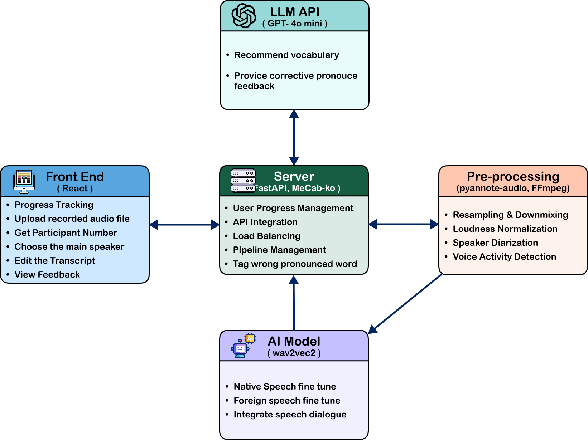
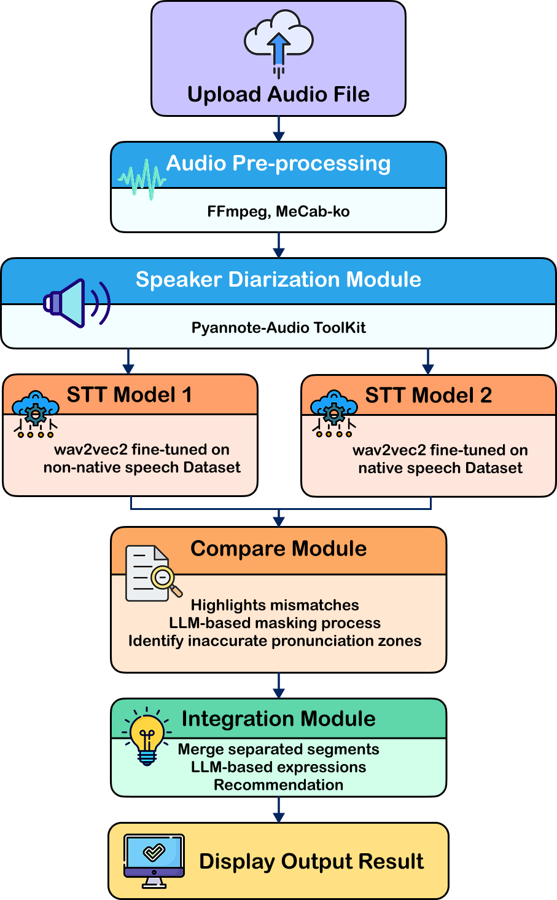

# STT_Foreign: Foreign Korean Speech Recognition Model Training

[](https://github.com/Team-Speakor/STT_Foreign)
[]()
[](https://www.python.org/)
[](https://www.hanyang.ac.kr/)

## Project Overview

This repository contains the **Foreign Korean Speech Recognition Model Training** component of the **Speakor** project.

> **Speakor** is an AI-powered pronunciation feedback system for Korean language learners that detects pronunciation errors using a dual STT model architecture, comparing results between foreign-speaker STT and native Korean STT models.

### Repository Role

This repository is responsible for **training and optimizing STT models that convert non-standard foreign speech into standard Korean text**.

- **Model**: Wav2Vec2-based foreign Korean speech recognition
- **Dataset**: AI Hub Foreign Korean Speech Data (~20,000 sentences)
- **Goal**: Develop high-performance STT model for accurate foreign pronunciation transcription

## System Architecture

This STT_Foreign model is a core component of the Speakor system, one of **4 repositories**:



```
Overall System Structure:
├── STT_Foreign (This Repository) → Foreign Speech → Standard Text
├── STT_Korean → Same Speech → Actual Korean Text  
├── Server → Backend API, Error Analysis, GPT Feedback
└── Client_React → Frontend UI, Result Visualization
```

### Related Repositories:
- 🔸 **[STT_Foreign](https://github.com/Team-Speakor/STT_Foreign)** - Foreign STT Model (This Repository)
- **[STT_Korean](https://github.com/Team-Speakor/STT_Korean)** - Korean STT Model
- **[Server](https://github.com/Team-Speakor/Server)** - FastAPI Backend
- **[Client_React](https://github.com/Team-Speakor/Client_React)** - React Frontend

### Processing Flow Role:



```
[Audio Input] → [Speaker Separation] → [Dual STT Inference]
                                          ├── 🔸 STT_Foreign (This Repository)
                                          └── STT_Korean
                                          ↓
                                    [Error Analysis & Feedback] (Server)
                                          ↓
                                    [Result Visualization] (Client_React)
```

### Tech Stack (This Repository)
| Component | Technology | Role |
|-----------|------------|------|
| **STT Model** | Wav2Vec2 (HuggingFace) | Foreign Speech → Standard Korean Text |
| **Data Processing** | pandas, librosa | Audio data preprocessing and analysis |
| **Model Training** | transformers, torch | Model fine-tuning and evaluation |
| **Evaluation Metrics** | WER, CER | Speech recognition performance measurement |

## Dataset

### Data Source
- **Foreign Korean Speech Data**: AI Hub provided, ~20,000 sentences
  - Various native language backgrounds (Chinese, English, Japanese, etc.)
  - Contains pronunciation errors, intonation distortions typical of foreign speakers
  - **Purpose**: Training foreign STT model in this repository

### Data Preprocessing
- Text normalization: Korean-only extraction, whitespace cleanup
- Audio normalization: 16kHz sampling, volume normalization
- Missing label data filtering

## Model Training and Experiments

### Experiment Timeline

#### **Project Foundation** (Kyung-Jin Min)
- **Data Discovery**: Discovered and secured foreign Korean speech data from AI Hub
- **System Architecture Design**: Proposed pronunciation error detection idea based on dual STT model comparison
- **Overall Flow Design**: Designed Audio → STT → Comparison → Feedback pipeline

#### Experiment 01: Initial Model Development (Yong-Jae Kim)
- **Goal**: Started fine-tuning basic Wav2Vec2 model
- **Key Files**: `notebooks/experiment_01/`

#### Experiment 02: Model Optimization Attempt (Kyung-Jin Min)
- **Goal**: Improve training stability and performance
- **Key Contribution**: Built data preprocessing pipeline, experimented with training configurations
- **Key Files**: `notebooks/experiment_02/combine_emergency_fixed.py`

#### Experiment 03: Whisper Model Challenge (Kyung-Jin Min)
- **Innovation Attempt**: Challenged performance improvement with latest Whisper model
- **Model**: `ghost613/whisper-large-v3-turbo-korean`
- **Technical Challenge**: 
  - PEFT (LoRA) based 4bit quantization training
  - Applied memory optimization configurations
  - Implemented sophisticated training code
- **Result**: Identified technical constraints due to GPU memory limitations
- **Significance**: Explored latest technology applicability, provided future development direction
- **Key Files**: `notebooks/experiment_03/whisper_turbo_korean_train.py`

#### Experiment 04-05: Final Model Completion (Yong-Jae Kim)
- **Independent Development**: Developed new optimization strategies based on previous experiments
- **Key Innovations**:
  - Introduced progressive Feature Encoder unfreezing strategy after 5 epochs
  - Secured training stability with Gradient Accumulation 8 steps
  - Achieved optimal performance with fixed learning rate 3e-4
- **Final Achievement**:
  - **WER**: 0.186573 (18.66%) - Significant improvement over previous experiments
  - **CER**: 0.073379 (7.34%)
- **Key Files**: `notebooks/experiment_05/`

### Model Configuration Comparison

| Experiment | Contributor | Model | Key Contribution | Result |
|------------|-------------|-------|------------------|--------|
| **Project Planning** | Kyung-Jin Min | - | Data discovery, system idea | Project direction |
| **Experiment 02** | Kyung-Jin Min | Wav2Vec2 | Initial training attempt | Experience and insights |
| **Experiment 03** | Kyung-Jin Min | Whisper-Turbo | Innovation tech challenge | Technology exploration |
| **Experiment 01,04,05** | Yong-Jae Kim | Wav2Vec2 | Optimization strategy development | **WER 0.1866 Achievement** |

## Quick Start

### Prerequisites
```bash
# Python 3.8+ required
pip install torch transformers librosa pandas numpy
```

### Model Usage
```python
from transformers import Wav2Vec2ForCTC, Wav2Vec2Processor
import torch
import librosa

# Load final model (Download from Google Drive required)
model = Wav2Vec2ForCTC.from_pretrained("./models/phase2-2-6-conservative-model/")
processor = Wav2Vec2Processor.from_pretrained("kresnik/wav2vec2-large-xlsr-korean")

# Audio file inference
def transcribe_audio(audio_path):
    speech, rate = librosa.load(audio_path, sr=16000)
    inputs = processor(speech, sampling_rate=16000, return_tensors="pt")
    
    with torch.no_grad():
        logits = model(inputs.input_values).logits
    
    predicted_ids = torch.argmax(logits, dim=-1)
    transcription = processor.decode(predicted_ids[0])
    
    return transcription

# Usage example
result = transcribe_audio("sample_audio.wav")
print(f"Recognition Result: {result}")
```

## Final Results

### Model Performance Metrics
| Metric | Test Set | Real Environment |
|--------|----------|------------------|
| **WER** | **18.66%** 🎯 | 29-31% |
| **CER** | **7.34%** | - |
| **Improvement** | **67%** ⬆️ | - |

### Project Achievements
- **✅ Goal Achievement**: Successfully built foreign STT model
- **🔬 Technical Innovation**: Provided future direction through Whisper model application  
- **👥 Teamwork**: Complementary collaboration leveraging individual strengths
- **📈 Performance Improvement**: Stable model with 67% improvement over initial baseline

## Repository Structure

```
STT_Foreign/
├── data/                          # Training data
│   ├── train/                     # Training audio and labels
│   ├── valid/                     # Validation audio and labels
│   └── test/                      # Test data
├── notebooks/                     # Experiment notebooks collection
│   ├── experiment_01/             # Initial experiment (Yong-Jae Kim)
│   ├── experiment_02/             # Wav2Vec2 improvement attempt (Kyung-Jin Min)
│   │   ├── combine_emergency_fixed.py
│   ├── experiment_03/             # Whisper attempt (Kyung-Jin Min)
│   │   ├── whisper_turbo_korean_train.py
│   ├── experiment_04/             # Intermediate optimization (Yong-Jae Kim)
│   └── experiment_05/             # 🎯 Final model (Yong-Jae Kim)
│       ├── combine.ipynb          # Final training code
│       ├── model_finetuning.py    # Model fine-tuning
│       ├── data_preprocessing_and_eda.py
│       └── common_utils.py        # Utility functions
├── models/                        # Trained model storage
│   ├── phase2-2-5-model/          # Intermediate model
│   ├── phase2-2-5-training-log.csv
│   └── phase2-2-6-conservative-model/
├── results/                       # Experiment results
│   └── result.txt                 # Final WER/CER results
└── README.md                      # Project documentation
```

### Key File Descriptions

#### **experiment_05/** (Final Completed Model)
- `combine.ipynb`: Final training code and results
- `model_finetuning.py`: Model fine-tuning script
- `data_preprocessing_and_eda.py`: Data preprocessing logic

#### **experiment_03/** (Innovation Technology Challenge)
- `whisper_turbo_korean_train.py`: Latest Whisper model application challenge
- 4bit quantization + PEFT LoRA latest techniques applied
- Multiple GPU memory optimization techniques applied
- Provides future technology development direction

#### **results.txt**
- `result.txt`: Final WER 0.186573, CER 0.073379

## Technical Challenges and Solutions

### 1. Whisper Model Application Attempt (Kyung-Jin Min)
**Challenge Background**: Performance improvement with latest Whisper model
```python
# 4bit quantization + PEFT LoRA latest techniques applied
quantization_config = BitsAndBytesConfig(
    load_in_4bit=True,
    bnb_4bit_quant_type="nf4",
    bnb_4bit_use_double_quant=True,
    bnb_4bit_compute_dtype=torch.bfloat16,
)

# Efficient fine-tuning with LoRA configuration
lora_config = LoraConfig(
    r=32, lora_alpha=64,
    target_modules=["q_proj", "k_proj", "v_proj", "o_proj"],
    task_type="SEQ_2_SEQ_LM"
)
```
**Significance**: 
- Sophisticated implementation integrating latest technologies
- Identified realistic constraints through GPU memory limitations
- Provided future development direction and technology roadmap

### 2. Training Performance Optimization
**Problem**: Low performance with WER over 60% in initial experiments
**Solutions**:
- Increased Gradient Accumulation Steps from 1 → 8
- Removed learning rate scheduling, used fixed learning rate
- Introduced progressive Feature Encoder unfreezing strategy
**Result**: Improved WER to 18.66%

## Performance Metrics


## Tech Stack

### Model and Framework


### Experiment and Analysis


## Contributors

**Complete Speakor Team**: Jeong-Woo Eum, Yong-Jae Kim, Kyung-Jin Min, Ji-Woo Park, Yu-Jun Lee (Hanyang University ERICA Computer Science)

### Key Contributors

<table>
    <tr height="160px">
        <td align="center" width="160px">
            <a href="https://github.com/KJ-Min"></a>
            <br/>
            <a href="https://github.com/KJ-Min"><strong>Kyung-Jin Min</strong></a>
            <br />
            <sub>Project Designer</sub>
        </td>
        <td>
            <strong>🎯 Project Planning & Technology Exploration</strong><br/>
            • AI Hub data discovery and system architecture design<br/>
            • Proposed dual STT model comparison-based pronunciation error detection idea<br/>
            • Whisper model application attempt (PEFT LoRA + 4bit quantization)<br/>
            • Led Experiment 02, 03 - Innovation technology challenge<br/>
            • Overall system flow design and pipeline construction
        </td>
    </tr>
</table>

<table>
    <tr height="160px">
        <td align="center" width="160px">
            <a href="https://github.com/Songforthesilent"></a>
            <br/>
            <a href="https://github.com/Songforthesilent"><strong>Yong-Jae Kim</strong></a>
            <br />
            <sub>Lead Engineer</sub>
        </td>   
        <td>
            <strong>🚀 Model Optimization & Achievement</strong><br/>
            • <b>Final WER 18.66% Achievement</b> - Project core success 🏆<br/>
            • Wav2Vec2 systematic optimization and hyperparameter tuning<br/>
            • Feature Encoder progressive unfreezing strategy development<br/>
            • Completed Experiment 01, 04, 05 - Stable model implementation<br/>
            • 67% performance improvement achieving project goals
        </td> 
    </tr>
</table>

## References

### Complete Project
- **GitHub Organization**: [Team-Speakor](https://github.com/Team-Speakor)
  - **[STT_Foreign](https://github.com/Team-Speakor/STT_Foreign)**: Foreign STT Model (This Repository)
  - **[STT_Korean](https://github.com/Team-Speakor/STT_Korean)**: Korean STT Model
  - **[Server](https://github.com/Team-Speakor/Server)**: Backend Server (FastAPI)
  - **[Client_React](https://github.com/Team-Speakor/Client_React)**: Frontend (React)

### Project Documentation
- **Final Report**: Detailed system design and implementation results
- **Notion Documentation**: [Project Progress Records](https://agate-pulsar-e23.notion.site/1bbfac7f80918021bd60f6707c6d689c)
- **Model Weights**: [Google Drive Link](https://drive.google.com/drive/folders/1Qf9Ckv8WvzoYZ_QaQY9v1ibdcst6S4H6?usp=sharing)

### Dataset and Technology
- [AI Hub - Foreign Korean Speech Data](https://aihub.or.kr/)
- [kresnik/wav2vec2-large-xlsr-korean](https://huggingface.co/kresnik/wav2vec2-large-xlsr-korean) - Base model
- [ghost613/whisper-large-v3-turbo-korean](https://huggingface.co/ghost613/whisper-large-v3-turbo-korean) - For Whisper attempt

